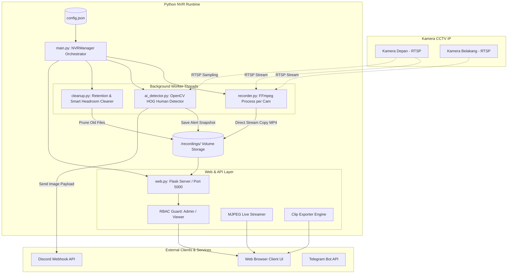

# System Architecture - Python NVR

Dokumen ini mendokumentasikan arsitektur teknis, aliran data, dan interaksi antarkomponen di dalam sistem Python NVR.

---

## 1. Diagram Arsitektur Tingkat Tinggi



---

## 2. Komponen Utama

### 2.1. NVR Orchestrator (`app/main.py`)
* **Tanggung Jawab:** Inisialisasi konfigurasi, manajemen daur hidup (*lifecycle*) thread, sinkronisasi kamera dinamis, dan penanganan sinyal terminasi (*graceful shutdown*).
* **Mekanisme Sync:** Secara periodik membaca `config.json` dan jadwal aktif (*schedule*). Menghidupkan atau mematikan worker `Recorder` dan `AIDetector` sesuai status kamera yang diubah di Web UI.
* **Fail-Safe Mechanism:** Membungkus import modul AI (`ai_detector.py`) dalam blok `try...except` agar kegagalan library Computer Vision tidak menggagalkan fungsi utama perekam dan web dashboard.

### 2.2. Stream Recorder Engine (`app/recorder.py`)
* **Tanggung Jawab:** Menjalankan dan mengawasi proses biner FFmpeg per kamera.
* **FFmpeg Pipeline Parameters:**
  ```bash
  ffmpeg -rtsp_transport tcp -i <rtsp_url> \
         -c copy -map 0 \
         -f segment -segment_time 900 -reset_timestamps 1 \
         -strftime 1 "/recordings/<cam_id>/%Y-%m-%d_%H-%M-%S.mp4"
  ```
* **Karakteristik Kunci:**
  * **Direct Stream Copy (`-c copy`):** Tanpa proses re-encoding, bitstream H.264/H.265 langsung ditulis ke disk, beban CPU < 1% per stream.
  * **TCP Transport (`-rtsp_transport tcp`):** Mencegah korupsi frame akibat packet drop UDP pada jaringan lokal.
  * **Health Check & Auto-Restart:** Memeriksa `poll()` status proses FFmpeg. Jika kamera putus, status ditandai offline dan proses direstart otomatis.

### 2.3. AI Human Detector (`app/ai_detector.py`)
* **Tanggung Jawab:** Pemrosesan computer vision di background untuk mendeteksi keberadaan orang pada area kamera.
* **Alur Kerja:**
  1. Menghubungkan stream sekunder atau stream utama via OpenCV `cv2.VideoCapture(rtsp_url)`.
  2. Melakukan *frame skipping* (hanya memproses 1 frame setiap 2 detik).
  3. Frame di-*resize* ke 640x360 untuk akselerasi komputasi.
  4. Deteksi menggunakan `cv2.HOGDescriptor` dengan SVM People Detector.
  5. Menghitung *confidence score* (ambang batas > 0.5).
  6. Menggambar *bounding box* hijau pada frame resolusi asli, menyimpan snapshot ke `/recordings/{cam_id}/alerts/`.
  7. Menembakkan *multipart POST request* ke Discord Webhook dengan menyertakan file gambar JPEG.
  8. Menjalankan *cooldown timer* (60 detik) per kamera untuk mencegah notifikasi beruntun.

### 2.4. Smart Storage Cleaner (`app/cleanup.py`)
* **Tanggung Jawab:** Manajemen ruang penyimpanan dan retensi data.
* **Thread Loop:** Berjalan setiap 1 jam sekali.
* **Aturan Pembersihan:**
  1. **Time-Based Retention:** Menghapus file rekaman yang usia modifikasinya (`mtime`) melebihi `retention_days`.
  2. **Smart Headroom Protection:** Memeriksa sisa ruang disk (`shutil.disk_usage`). Jika sisa ruang < `min_free_gb` (default 5GB), sistem akan menghapus file tertua secara berurutan hingga sisa ruang kembali di atas batas aman.

### 2.5. Web Server & API Layer (`app/web.py`)
* **Tanggung Jawab:** Menyajikan UI Dashboard, endpoint REST API, otentikasi sesi, stream proxy MJPEG, dan ekspor klip video.
* **Proteksi Endpoint:**
  * `@login_required`: Memastikan pengguna telah terautentikasi.
  * `@admin_required`: Memastikan peran pengguna adalah `admin` untuk endpoint mutasi (Settings, Add/Edit/Delete Camera, Storage Cleanup, User Management).
* **Live Streaming Proxy:** Membaca stream RTSP via FFmpeg dan mengonversi secara *on-the-fly* menjadi multipart HTTP stream (`multipart/x-mixed-replace`) untuk rendering tag `` di browser.
* **Clip Exporter:** Memotong rentang waktu video tertentu menggunakan FFmpeg dengan opsi *Time-Lapse* (filter `setpts=0.05*PTS`) dan mengembalikan file MP4 langsung ke browser.

---

## 3. Topologi Jaringan & Protokol

| Komponen | Protokol | Port | Keterangan |
| :--- | :--- | :--- | :--- |
| IP Camera -> NVR | RTSP (TCP) | 554 | Pengambilan stream video H.264 |
| Browser -> NVR Dashboard | HTTP | 5000 | Web UI, REST API, Playback, MJPEG |
| NVR -> Discord API | HTTPS | 443 | Pengiriman notifikasi alert + gambar |
| NVR -> IP Camera (PTZ) | HTTP / CGI | 80 / 8000 | Kontrol pergerakan arah kamera |
